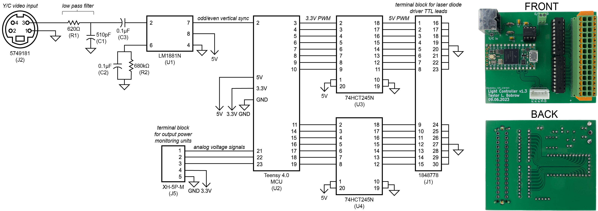
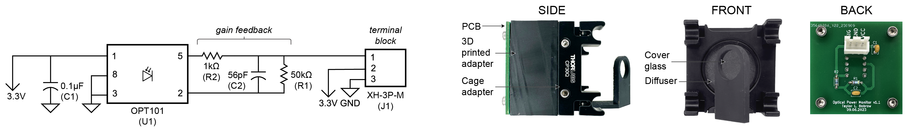

# Light Modulation Controller
The Light Modulation Controller controls the laser diodes within the multi-contrast laser illumination source. Packets containing pulse width lengths are continually sent by the host desktop to the controller over Serial USB. The controller connects to power monitoring units within the illumination source and sends measured voltage values back to the host desktop over Serial USB.

## Light Modulation Controller Hardware
Connector J2 of the light modulation controller printed circuit board (PCB) connects to the analog separate video (S-video) output of the Olympus CV-190 video processor via a 4-pin mini-DIN cable. The analog video signal is low pass filtered and input to a video sync separator chipset (LM1881) to extract the odd/even field vertical synchronization pulses for timing synchronization of the lasers. Pulse width modulation of the lasers is managed by a Teensy 4.0 microcontroller. Below is a schematic and images of the fabricated PCB:

[Gerber files](./hardware/lmc_gerber/) for fabricating the light modulation controller printed circuit board (PCB) are included in the repository. Below is a list of components for the PCB:

| ID | Component |
| --- | --- |
| C1 | 510 pF Capacitor, 2.5mm pitch |
| C2/C3 | 0.1 uF Capacitor, 2.5mm pitch |
| J1 | 1848778, Phoenix Contact |
| J2 | 5749181, TE Connectivity |
| J3 | 0022232051, Molex |
| J4 | OSTVN02A150, On Shore Technology |
| J5 | XH-5P-M, 5-Pin JST Male Connector |
| R1 | 620 Ω resistor, 3.6mm length, 1.6mm diameter, 5.08mm pitch |
| R2 | 680 kΩ resistor, 3.6mm length, 1.6mm diameter, 5.08mm pitch |
| U1 | LM1881N, Texas Instruments |
| U2 | Teensy 4.0 USB Development Board w/ Headers, PJRC |
| U3/U4 | 74HCT245N, Nexpedia |

## Light Modulation Controller Software
The light modulation controller [software file](./software/teensy.ino) should be compiled and uploaded to the Teensy 4.0 using the Arduino IDE. The program requires the TeensyTimerTool and CircularBuffer libraries, which are available for instillation via the Arduino IDE.

## Power Monitoring Unit Hardware

To correct for drift and instability in the laser output power, a power monitoring unit was included in each of the three optical outputs of the illumination source. The power monitoring units use a coverglass slip to pick off a small percentage of light that is measured by a photodiode. A neutral density filter reduces the optical power to a value within the dynamic range of the photodiode, and a ground glass diffuser spreads the light to reduce sensitivity to alignment with the photodiode. The photodiode PCB, diffuser, neutral density filter, and cover glass are combined with a 3D-printed mount and a cage adapter that attaches to a standard 30x30 mm optical rail setup. Below is a schematic and images of the assembled unit:

[Gerber files](./hardware/pmu_gerber/) for fabricating the power monitoring unit PCBs are included in the repository. Below is a list of components for the PCB:

| ID | Component |
| --- | --- |
| C1 | 0.1 uF Capacitor, 2.5mm pitch |
| C2 | 56 pF Capacitor, 2.5mm pitch |
| J1 | XH-3P-M, 3-Pin JST Male Connector |
| R1 | 50 kΩ resistor, 3.6mm length, 1.6mm diameter, 5.08mm pitch |
| R2 | 1 kΩ resistor, 3.6mm length, 1.6mm diameter, 5.08mm pitch |
| U1 | OPT101, Texas Instruments |

Hardware components for assembling the full power monitoring unit are listed below. A 3D model file for 3D printing the adapter mount is available at [3D-printed adapter mount](./hardware/pmu_mount.STL). The glass coverslip was attached to the adapter mount using ultraviolet curing optical adhesive (Norland, 65) and an ultraviolet light.

| Qty | Component |
| --- | --- |
| 1 | 3D-printed adapter mount |
| 1 | 30 mm to 30 mm Cage System Snap-On Right-Angle Adapter, CP30Q, Thorlabs |
| 1 | Ground Glass Diffuser, 120 Grit, DG10-120, Thorlabs |
| 1 | Glass Coverslip, 12 mm diameter, 26023, Ted Pella Inc. |
| 1 | Neutral Density Filter, 0.8 Optical Density, NE08A-A, Thorlabs |
| 4 | 4-40 Stainless Steel Cap Screw, 1/4 in Long |
| 4 | Cage Assembly Rod, 1 in Long, 6 mm Diameter, ER1, Thorlabs |

## License
This work is licensed under CC BY-NC-SA 4.0
